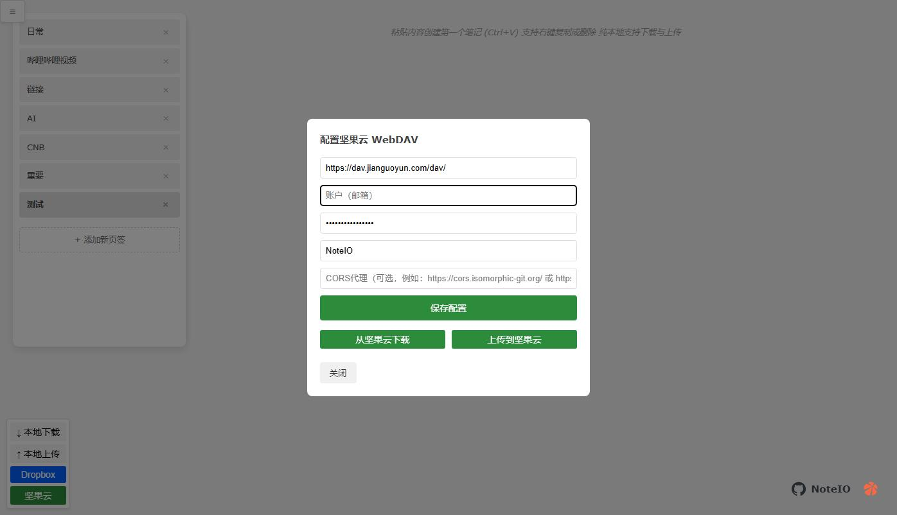

# NoteIO

一个简单的本地剪贴笔记本！

有没有过当你看到一句话一个url的时候不知道复制在哪儿存着，然后有空再看。

哪些不重要，但是有不想忘的东西。

那么就可以用它。

## 更新日志
### 2025年10月6日
支持vercel安装 支持自动上传到dropbox。

Root Directory：**选择目录为vercel**

添加变量 Environment Variables

DROPBOX_CLIENT_ID=App key

DROPBOX_CLIENT_SECRET=App secret

其他都是默认

App key与App secret需要去https://www.dropbox.com/developers/apps/ 申请

OAuth 2
Redirect URIs

写入你的网站地址。

Permissions 需要开放权限为 （记得报错）

files.content.write

files.content.read

## 使用方式

使用Ctrl+v粘贴内容，就这么简单

右键标签可以进行复制/删除/置顶

右边可以使用标签页区分

## 游览器插件

插件在NoteIO Edge Extension文件夹中

1. 打开edge://extensions/
2. 开启开发人员模式（在左边）
3. 如果是压缩包直接拖入其中，如果是解压的，选择上方`加载解压缩的扩展`

- 添加坚果云备份

